# tvt内核获取

在获取设备shell时遇到了一些问题，希望得到感兴趣大佬们的指点23333

## 固件分析

固件解压，binwalk分析

```python
226464        0x374A0         CRC32 polynomial table, little endian
301628        0x49A3C         JPEG image data, JFIF standard 1.01
303285        0x4A0B5         JPEG image data, JFIF standard 1.01
393272        0x60038         PNG image, 350 x 55, 8-bit/color RGBA, non-interlaced
393427        0x600D3         Zlib compressed data, default compression
398580        0x614F4         PNG image, 693 x 236, 8-bit/color RGBA, non-interlaced
517088        0x7E3E0         XML document, version: "1.0"
524288        0x80000         JPEG image data, JFIF standard 1.01
524318        0x8001E         TIFF image data, big-endian, offset of first image directory: 8
655416        0xA0038         PNG image, 350 x 55, 8-bit/color RGBA, non-interlaced
655571        0xA00D3         Zlib compressed data, default compression
660724        0xA14F4         PNG image, 693 x 236, 8-bit/color RGBA, non-interlaced
779232        0xBE3E0         XML document, version: "1.0"
917504        0xE0000         uImage header, header size: 64 bytes, header CRC: 0xFDB88F62, created: 2021-08-28 07:51:25, image size: 2156739 bytes, Data Address: 0x80008000, Entry Point: 0x80008000, data CRC: 0x2E36A415, OS: Linux, CPU: ARM, image type: OS Kernel Image, compression type: none, image name: "Linux-4.9.37"
917568        0xE0040         Linux kernel ARM boot executable zImage (little-endian)
3064720       0x2EC390        Flattened device tree, size: 9587 bytes, version: 17
3145728       0x300000        Squashfs filesystem, little endian, version 4.0, compression:xz, size: 20383964 bytes, 1711 inodes, blocksize: 1048576 bytes, created: 2023-02-08 05:27:36
27262976      0x1A00000       JFFS2 filesystem, little endian
27263816      0x1A00348       Zlib compressed data, compressed
27264336      0x1A00550       Zlib compressed data, compressed
27264900      0x1A00784       Zlib compressed data, compressed
27265464      0x1A009B8       Zlib compressed data, compressed
27266084      0x1A00C24       Zlib compressed data, compressed
27266732      0x1A00EAC       Zlib compressed data, compressed
27267392      0x1A01140       Zlib compressed data, compressed
27268060      0x1A013DC       Zlib compressed data, compressed
27269016      0x1A01798       Zlib compressed data, compressed
27269676      0x1A01A2C       Zlib compressed data, compressed
27270356      0x1A01CD4       Zlib compressed data, compressed
27271044      0x1A01F84       Zlib compressed data, compressed
27271752      0x1A02248       Zlib compressed data, compressed
27272468      0x1A02514       Zlib compressed data, compressed
27273192      0x1A027E8       Zlib compressed data, compressed
27273920      0x1A02AC0       Zlib compressed data, compressed
27274888      0x1A02E88       JFFS2 filesystem, little endian
27285112      0x1A05678       JFFS2 filesystem, little endian
27285352      0x1A05768       JFFS2 filesystem, little endian
30212176      0x1CD0050       Zlib compressed data, compressed
30213084      0x1CD03DC       JFFS2 filesystem, little endian
30213852      0x1CD06DC       Zlib compressed data, compressed
30214952      0x1CD0B28       Zlib compressed data, compressed
30215924      0x1CD0EF4       JFFS2 filesystem, little endian
30217156      0x1CD13C4       Zlib compressed data, compressed
30217424      0x1CD14D0       JFFS2 filesystem, little endian
30218812      0x1CD1A3C       Zlib compressed data, compressed
30218992      0x1CD1AF0       Zlib compressed data, compressed
30219152      0x1CD1B90       Zlib compressed data, compressed
30219588      0x1CD1D44       Zlib compressed data, compressed
30220556      0x1CD210C       Zlib compressed data, compressed
30221084      0x1CD231C       Zlib compressed data, compressed
30222236      0x1CD279C       Zlib compressed data, compressed
30222704      0x1CD2970       Zlib compressed data, compressed
30223896      0x1CD2E18       Zlib compressed data, compressed
30224300      0x1CD2FAC       JFFS2 filesystem, little endian
30231792      0x1CD4CF0       Zlib compressed data, compressed
30233356      0x1CD530C       Zlib compressed data, compressed
30235000      0x1CD5978       Zlib compressed data, compressed
```

搜索关键字符串，找到内核的启动命令，得到内存的布局

```bash
# strings MX25L25633F@WSON8_20230829_113609.BIN |grep bootargs
bootargs
bootargs=mem=96M console=ttyAMA0,115200
bootargs
    bootargs=mem=179M user_args=a0179Mnva010000 console=ttyAMA0,115200 root=/dev/mtdblock2 rootfstype=squashfs mtdparts=hi_sfc:896K(boot),2176K(nva010000),23M(app),4M(config),2M(log)
bootargs
```

这段内容的解释为

1.  `bootargs`：这是一个内核参数，用于在启动过程中传递给Linux内核的命令行参数。
2.  `mem=179M`：此参数将系统可用的总内存设置为179兆字节。
3.  `user_args=a0179Mnva010000`：这似乎是一个自定义参数，可能用于系统的特定配置目的。这不是标准的Linux内核参数。
4.  `console=ttyAMA0,115200`：这设置了内核消息和调试输出的串行控制台端口和波特率。在这种情况下，它使用串行端口 `ttyAMA0`，波特率为115200。
5.  `root=/dev/mtdblock2`：这指定了根文件系统设备。`/dev/mtdblock2` 可能是指一个内存技术设备（MTD）块设备，在嵌入式系统中常用于管理闪存存储。
6.  `rootfstype=squashfs`：这将根文件系统的类型设置为SquashFS，一种常用于嵌入式系统的压缩只读文件系统，以节省空间。
7.  `mtdparts=hi_sfc:896K(boot),2176K(nva010000),23M(app),4M(config),2M(log)`：此参数定义了内存技术设备（MTD）的布局。它使用 `mtdparts` 语法来指定闪存内的分区。格式为 `size(name)`，其中 `size` 是分区的大小，`name` 是分区的标签。
    -   `896K(boot)`：这是一个标记为 "boot" 的分区，大小为896千字节。
    -   `2176K(nva010000)`：这是一个标记为 "nva010000" 的分区，大小为2176千字节。
    -   `23M(app)`：这是一个标记为 "app" 的分区，大小为23兆字节。
    -   `4M(config)`：这是一个标记为 "config" 的分区，大小为4兆字节。
    -   `2M(log)`：这是一个标记为 "log" 的分区，大小为2兆字节。

总之，得到如下信息

-   0-`896K` （0xe0000     `896*`1024）存放uboot
-   0xe0000-  0x300000（`896*`1024+2176\*1024）（`2176K`）存放kernel
-   0x300000-0x1a00000    （`23M`）为 Squashfs文件系统

uImage、zImage、vmlinux关系如下[https://zhuanlan.zhihu.com/p/466226177](https://zhuanlan.zhihu.com/p/466226177 "https://zhuanlan.zhihu.com/p/466226177")

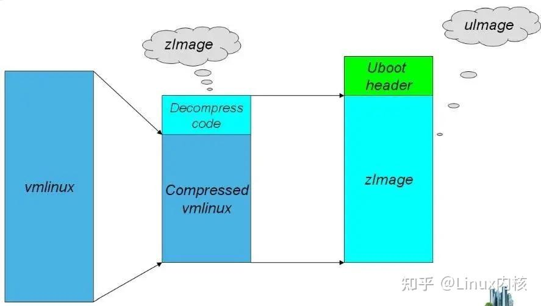

uboot提供了mkimage工具，来将kernel制作为uboot可以识别的格式，将生成的文件称之为uImage。 &#x20;
uboot支持两种类型的uImage

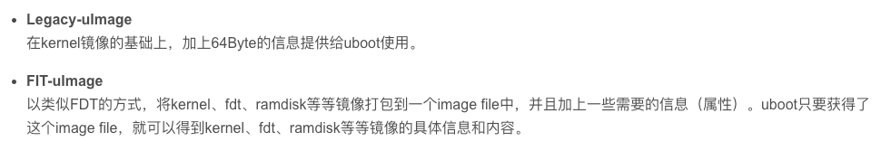

这里使用的是Legacy-uImage，用file命令可以看出来

```bash
../uImage: u-boot legacy uImage, Linux-4.9.37, Linux/ARM, OS Kernel Image (Not compressed), 2156739 bytes, Sat Aug 28 07:51:25 2021, Load Address: 0x80008000, Entry Point: 0x80008000, Header CRC: 0xFDB88F62, Data CRC: 0x2E36A415
```

文件系统信息

参考 [https://sabersauce.github.io/2016/07/28/squashFS-文件系统/](https://sabersauce.github.io/2016/07/28/squashFS-文件系统/ "https://sabersauce.github.io/2016/07/28/squashFS-文件系统/")

```python
(base) ➜  squashfs-info git:(master) ✗ ./squashfs-info ../_MX25L25633F@WSON8_20230829_113609.BIN.extracted/300000.squashfs
s_magic:                1936814952
inodes:                 1711
mkfs_time:              1675834056
block_size:             1048576
fragments:              27
compresultsion:         4    xz压缩
block_log:              20
flags:                  192
no_ids:                 2
s_major:                4
s_minor:                0
root_inode:             735320905
bytes_used:             20383964
id_table_start:         20383956
xattr_id_table_start:   18446744073709551615
inode_table_start:      20349938
directory_table_start:  20362450
fragment_table_start:   20380678
lookup_table_start:     20383930
```

xz源码下载[https://tukaani.org/xz/embedded.html](https://tukaani.org/xz/embedded.html "https://tukaani.org/xz/embedded.html")

经过分析，逆向一些结构，但是并没有看出来具体的区别。

### 通过对比正常编译的linux内核看看有什么区别

[https://cdn.kernel.org/pub/linux/kernel/v4.x/](https://cdn.kernel.org/pub/linux/kernel/v4.x/ "https://cdn.kernel.org/pub/linux/kernel/v4.x/")

```python
cp arch/arm64/configs/defconfig .config
make menuconfig    General setup -> Kernel compression mode选中xz

make uImage -j8 ARCH=arm CROSS_COMPILE=arm-linux-gnueabi-

```

编译得到

-   uImage   uboot引导的压缩内核，使用legacy方式封装（ida可以反编译uImage，不能反编译zImage）

```python
base) ➜  linux-4.9.37 file ./uImage
./uImage: u-boot legacy uImage, Linux-4.9.37, Linux/ARM, OS Kernel Image (Not compressed), 2753184 bytes, Thu Aug 31 08:04:24 2023, Load Address: 0x00008000, Entry Point: 0x00008000, Header CRC: 0xF5E1C379, Data CRC: 0xBD530687
```

找了一下zImage的结构，找到了这个，他的逻辑是是找到xz 的magic然后dd取出内容，最后解压。由此确定uImage文件包含

[https://gist.github.com/AndrewFasano/63829879f7a7a1eec86e858c45ec5c40#file-extract-vmlinux-sh](https://gist.github.com/AndrewFasano/63829879f7a7a1eec86e858c45ec5c40#file-extract-vmlinux-sh "https://gist.github.com/AndrewFasano/63829879f7a7a1eec86e858c45ec5c40#file-extract-vmlinux-sh")

-   uImage头
-   可执行部分，由uboot引导跳转到这里，执行xz解包程序（如果是xz压缩）
-   vmlinux程序压缩包

    编译的uImage开头如下图所示

    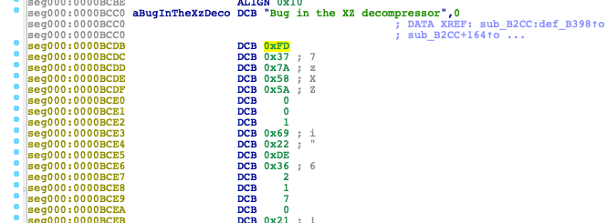

    从tvt nvr设备中取出的固件经过搜索字符串，找到了类似的位置，但是这里明显被厂商修改了。猜测是修改了标准的xz解密程序。

    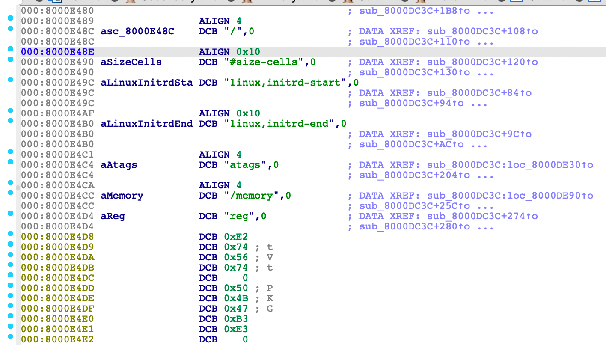

查看内核中xz解包程序的源码lib/decompress\_unxz.c，在编译的uImage中也可以找到对应内容，通过对比源码，找到dec\_main函数

```python
static enum xz_ret dec_main(struct xz_dec *s, struct xz_buf *b)
```

核心结构体在lib/xz/xz\_dec\_stream.c文件，进行一些简答修改，用ida的ctl+f9即可加载

## xz分析分析

### xz文件结构

**.xz**作为.lzma的替代，它的文件结构更复杂，包含的元信息更多。.xz文件可以由多个Stream和Stream Padding组成，但通常只有一个Stream。[http://maruchen.github.io/2015/03/The base knowledge about 7z, xz and lzma/](<http://maruchen.github.io/2015/03/The base knowledge about 7z, xz and lzma/> "http://maruchen.github.io/2015/03/The base knowledge about 7z, xz and lzma/")

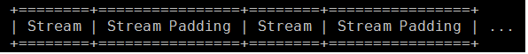

stream格式如下

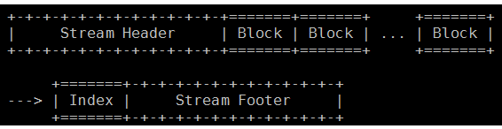

Stream Header包含magic number（FD 37 7A 58 5A 00）、Stream Flags以及CRC校验。其中Stream Flgas是CRC校验的类型。

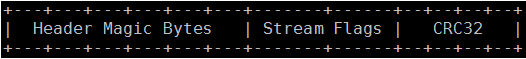

Block包含Block Header和压缩数据。Block Header包含了压缩算法（filter）的数目和属性、数据长度以及CRC校验。

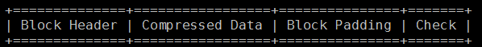

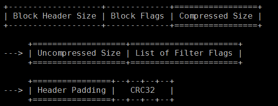

index作用和结构

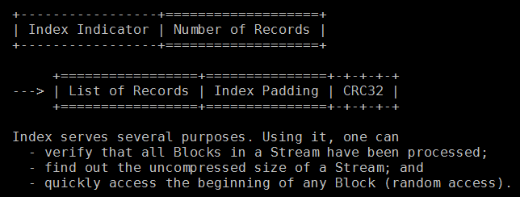

Stream Footer的结构如下。其中Backward Size是Index模块的大小，用来在从后向前处理时快速定位到Index的位置。magic为 59 5a （YZ）

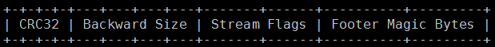

### xz源码分析

入口函数为unxz，参数为

-   xz\_crc32\_init函数使用一个常量初始化一块内存保存到全局变量。这个初始化结果为定值

```python
XZ_EXTERN void xz_crc32_init(void)
{
  const uint32_t poly = 0xEDB88320;
  for (i = 0; i < 256; ++i) {
    r = i;
    for (j = 0; j < 8; ++j)
      r = (r >> 1) ^ (poly & ~((r & 1) - 1));
    xz_crc32_table[i] = r;  //保存结果

```

-   xz\_dec\_init函数主要是初始化空间
    -   对struct xz\_dec的初始化
    ```python
    XZ_EXTERN void xz_dec_reset(struct xz_dec *s)
    {
      s->sequence = SEQ_STREAM_HEADER;  //单一模式
      s->allow_buf_error = false;
      s->pos = 0;
      s->crc = 0;
      memzero(&s->block, sizeof(s->block));
      memzero(&s->index, sizeof(s->index));
      s->temp.pos = 0;
      s->temp.size = STREAM_HEADER_SIZE;
    }
    ```
-   xz\_dec\_run函数为解密主函数
-   可以通过后面的字符串判断该函数的位置
-   b是保存着xz\_buf结构体，保存着xz输入的数据信息
-   s是xz\_dec结构体，执行的核心流程需要这个结构体，unxz中申请空间初始化

```python
STATIC int INIT unxz(unsigned char *in, int in_size,
         int (*fill)(void *dest, unsigned int size),
         int (*flush)(void *src, unsigned int size),
         unsigned char *out, int *in_used,
         void (*error)(char *x))
{
  struct xz_buf b;
  struct xz_dec *s;
  enum xz_ret ret;
  bool must_free_in = false;

#if XZ_INTERNAL_CRC32
  xz_crc32_init();
#endif

  if (in_used != NULL)
    *in_used = 0;

  if (fill == NULL && flush == NULL)
    s = xz_dec_init(XZ_SINGLE, 0);
  else
    s = xz_dec_init(XZ_DYNALLOC, (uint32_t)-1);
  if (s == NULL)
    goto error_alloc_state;

  if (flush == NULL) {
    b.out = out;
    b.out_size = (size_t)-1;
  } else {
    b.out_size = XZ_IOBUF_SIZE;
    b.out = malloc(XZ_IOBUF_SIZE);
    if (b.out == NULL)
      goto error_alloc_out;
  }

  if (in == NULL) {
    must_free_in = true;
    in = malloc(XZ_IOBUF_SIZE);
    if (in == NULL)
      goto error_alloc_in;
  }

  b.in = in;
  b.in_pos = 0;
  b.in_size = in_size;
  b.out_pos = 0;

  if (fill == NULL && flush == NULL) {
    ret = xz_dec_run(s, &b);
  } else {
    do {
      if (b.in_pos == b.in_size && fill != NULL) {
        if (in_used != NULL)
          *in_used += b.in_pos;

        b.in_pos = 0;

        in_size = fill(in, XZ_IOBUF_SIZE);
        if (in_size < 0) {
          /*
           * This isn't an optimal error code
           * but it probably isn't worth making
           * a new one either.
           */
          ret = XZ_BUF_ERROR;
          break;
        }

        b.in_size = in_size;
      }

      ret = xz_dec_run(s, &b);

      if (flush != NULL && (b.out_pos == b.out_size
          || (ret != XZ_OK && b.out_pos > 0))) {
        /*
         * Setting ret here may hide an error
         * returned by xz_dec_run(), but probably
         * it's not too bad.
         */
        if (flush(b.out, b.out_pos) != (int)b.out_pos)
          ret = XZ_BUF_ERROR;

        b.out_pos = 0;
      }
    } while (ret == XZ_OK);

  if (in_used != NULL)
    *in_used += b.in_pos;

  xz_dec_end(s);

  switch (ret) {
  case XZ_STREAM_END:
    return 0;

  case XZ_MEM_ERROR:
    /* This can occur only in multi-call mode. */
    error("XZ decompressor ran out of memory");
    break;

  case XZ_FORMAT_ERROR:
    error("Input is not in the XZ format (wrong magic bytes)");
    break;

```

核心函数dec\_main分析

-   函数fill\_temp主要是拷贝b中数据到s->temp.buf
    ```python
      memcpy(s->temp.buf + s->temp.pos, b->in + b->in_pos, copy_size);
      b->in_pos += copy_size;
      s->temp.pos += copy_size;
    ```
-   然后通过赋予sequence不同的值，让数据进入不同的执行流程
    -   SEQ\_STREAM\_HEADER 校验xz头的crc
    -   SEQ\_BLOCK\_START 准备解析block
    -   SEQ\_BLOCK\_HEADER对block头校验
    -   在dec\_block函数中对lzma块进行解密
    -   。。。。。。
    -   校验页脚的内容

```python
static enum xz_ret dec_main(struct xz_dec *s, struct xz_buf *b)
{switch (s->sequence) {
    case SEQ_STREAM_HEADER:      处理xz结构头
    if (!fill_temp(s, b))
        return XZ_OK;
    s->sequence = SEQ_BLOCK_START;  设置接下来的逻辑为处理数据体
    ret = dec_stream_header(s); 
    case SEQ_BLOCK_START:   //为解析block做准备
      s->block_header.size
        = ((uint32_t)b->in[b->in_pos] + 1) * 4;

      s->temp.size = s->block_header.size;
      s->temp.pos = 0;
      s->sequence = SEQ_BLOCK_HEADER; 
      
    case SEQ_BLOCK_HEADER:
      if (!fill_temp(s, b))
        return XZ_OK;
      ret = dec_block_header(s);
      if (ret != XZ_OK)
        return ret;
      s->sequence = SEQ_BLOCK_UNCOMPRESS;  
    case SEQ_BLOCK_UNCOMPRESS: 
      ret = dec_block(s, b);
      if (ret != XZ_STREAM_END)
        return ret;

      s->sequence = SEQ_BLOCK_PADDING; 
    case SEQ_STREAM_FOOTER:   //最后处理页脚
      if (!fill_temp(s, b))
        return XZ_OK;
      return dec_stream_footer(s);
    }
     

```

dec\_stream\_header函数主要是解析xz头

-   首先校验magic
-   计算文件内容除去magic之后两字节的crc（对应Stream flag），计算结果和第8字节对比（存储的crc）  crc的计算比较简单。
    -   输入一个字节分别跟crc的高位和低位进行异或运算作为表的索引，计算出新的crc  &#x20;
    -   循环知道输入的每个字节参与运算，得到crc占4字节
    ```python
    uint32_t xz_crc32_table[256];
    XZ_EXTERN uint32_t xz_crc32(const uint8_t *buf, size_t size, uint32_t crc)
    {
      crc = ~crc;
      while (size != 0) {
        crc = xz_crc32_table[*buf++ ^ (crc & 0xFF)] ^ (crc >> 8);
        --size;
      }
      return ~crc;
    }
    ```

```python
static enum xz_ret dec_stream_header(struct xz_dec *s)
{
  if (!memeq(s->temp.buf, HEADER_MAGIC, HEADER_MAGIC_SIZE))//memmp
    return XZ_FORMAT_ERROR;

  if (xz_crc32(s->temp.buf + HEADER_MAGIC_SIZE, 2, 0)
      != get_le32(s->temp.buf + HEADER_MAGIC_SIZE + 2))
    return XZ_DATA_ERROR;
  if (s->temp.buf[HEADER_MAGIC_SIZE] != 0)
    return XZ_OPTIONS_ERROR;
```

dec\_stream\_footer函数对页脚的处理如下

-   进行一系列校验

```python
static enum xz_ret dec_stream_footer(struct xz_dec *s)
{
  if (!memeq(s->temp.buf + 10, FOOTER_MAGIC, FOOTER_MAGIC_SIZE))//magic YZ
    return XZ_DATA_ERROR;

  if (xz_crc32(s->temp.buf + 4, 6, 0) != get_le32(s->temp.buf)) //crc
    return XZ_DATA_ERROR;

  /*
   * Validate Backward Size. Note that we never added the size of the
   * Index CRC32 field to s->index.size, thus we use s->index.size / 4
   * instead of s->index.size / 4 - 1.
   */
  if ((s->index.size >> 2) != get_le32(s->temp.buf + 4))    //校验index size
    return XZ_DATA_ERROR;

  if (s->temp.buf[8] != 0 || s->temp.buf[9] != s->check_type) //校验flag
    return XZ_DATA_ERROR;

  return XZ_STREAM_END;
}
```

## 二进制文件分析

对xz头的处理

-   首先校验输入内容和tvt头（E2 74 56 74 00 50 4B 47 B3 E3 00）相等，实际上 50 4B 47 B3 E3 00不参与校验
-   校验crc  crc位在temp.buf\[12]，即偏移13位置处，和标准的xz头区别只有magic

```python
case SEQ_STREAM_HEADER:
          if ( !fill_temp(a1, a2) )
            goto xz_ok;
          v60 = off_8000B50C + 0x8000ACE8; //tvt头
          a1->sequence = SEQ_BLOCK_START;
          v61 = (xz_dec *)((char *)&a1->temp.size + 3);
          break;
 }
  do
      {   //校验tvt头
        v63 = (unsigned __int8)*v60++;
        v62 = v63;
        v64 = *(unsigned __int8 *)++v61;        // size+4，对应输入内容
        if ( v64 != v62 )                       //   输入内容，tvt头
        {
          v13 = 5;
LABEL_95:
          if ( a1->mode == XZ_SINGLE )
            goto LABEL_53;
          a1->allow_buf_error = 0;
          return v13;
        }
      }
      while ( &a1->temp.buf[10] != (char *)v61 );输入的第11位和v61相等，校验结束 
      v65 = (unsigned __int8)a1->temp.buf[12];
      if ( ~(*(_DWORD *)(*(_DWORD *)&v126[dword_8000B504]// crc校验
                       + 4
                       * ((unsigned __int8)~*(_BYTE *)(*(_DWORD *)&v126[dword_8000B504]
                                                     + 4 * (unsigned __int8)~a1->temp.buf[11]) ^ v65)) ^ (~(*(_DWORD *)(*(_DWORD *)&v126[dword_8000B504] + 4 * (unsigned __int8)~a1->temp.buf[11]) ^ 0xFF000000) >> 8)) != *(_DWORD *)&a1->temp.buf[13] )

 
```

在这里校验stream footer  要求最终几个字节为05 C5 00 74 56 74 5E

```python
LABEL_56:
                      if ( fill_temp(a1, a2) )
                      {
                        v37 = (int)&a1->temp.buf[9];// decode block header
                        v38 = tvt_header + 0x8000AA5C;
                        do
                        {
                          v40 = (unsigned __int8)*v38++;// 05 C5 00 74 56 74 5E 00
                          v39 = v40;
                          v41 = *(unsigned __int8 *)++v37;
                          if ( v41 != v39 )     // 遍历tvt头
                            goto LABEL_76;
                        }
                        while ( &a1->temp.buf[16] != (char *)v37 );//buf[16]为5E
                        v42 = (xz_dec *)&a1->temp.buf[4];
```

## 解压

读取对应内容然后替换，key为数据的开始，这里多添加了一些内容，因为tvt头在内存里有两份，换个版本不知道数据还是不是这样。

```python
import sys

def check(pos,info,key):
    for item in range(len(key)):
        if info[pos+item]!=key[item]:
            return False
    else:
        return True

with open(sys.argv[1] ,'rb') as fd:
    content=fd.read()


key =[0xE2, 0x74, 0x56, 0x74, 0x00, 0x50, 0x4B, 0x47, 0xB3, 0xE3,0x00,0x00,0x01]
off=0
for item in range(len(content)):
    if check(item,content,key) :
        print(hex(item))
        off=item
if off==0:
    print("未找到开始")
    sys.exit()
result=b"\xFD\x37\x7A\x58\x5A\x00\x00\x01"+content[off+len(key):]
print("len result: ",hex(len(result)))
footer=[0x05,0xC5,0x00,0x74,0x56,0x74,0x5E]
end=len(result)
for item in range(0,len(result)):
    
    # print(item)
    if check(item,result,footer):
        print("找到结尾")
        off=item
print(hex(off))
result=result[:off]+b'YZ'

with open("result.xz",'wb') as fd:
    fd.write(result)

```

但是解压之后只能得到目录

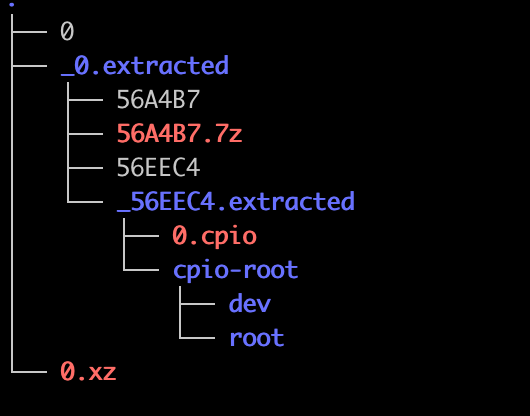

但是vmlinux中的一些关键字符串是存在的，还需要添加一些内容

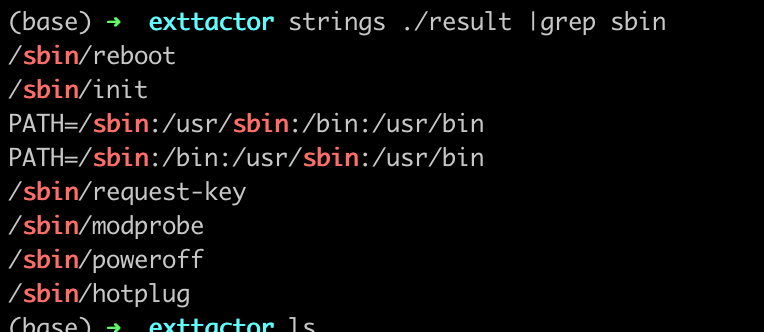

## 方案2：用qiling启动解密程序解密

在源码中通过搜索字符串找到这部分，为启动解密程序的代码

```python
decompress_kernel(unsigned long output_start, unsigned long free_mem_ptr_p,
    unsigned long free_mem_ptr_end_p,
    int arch_id)
{
  int ret;

  __stack_chk_guard_setup();

  output_data    = (unsigned char *)output_start;
  free_mem_ptr    = free_mem_ptr_p;
  free_mem_end_ptr  = free_mem_ptr_end_p;
  __machine_arch_type  = arch_id;

  arch_decomp_setup();

  putstr("Uncompressing Linux...");
  ret = do_decompress(input_data, input_data_end - input_data,
          output_data, error);
  if (ret)
    error("decompressor returned an error");
  else
    putstr(" done, booting the kernel.\n");
}

```

在固件中的uImage对应如下

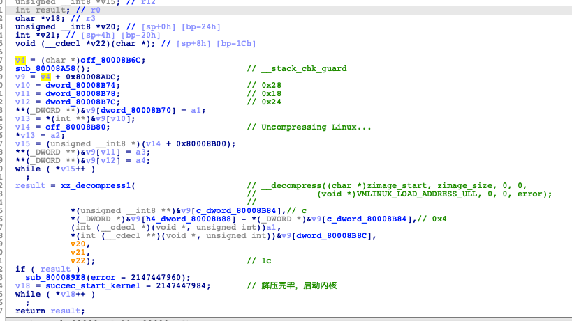

为了进一步确认没有被厂商自定义，编译了同版本的linux内核，进行对比，确认没有经过自定义（实际上这一步应该不会自定义，因为内核压缩包有crc校验，修改会不通过）

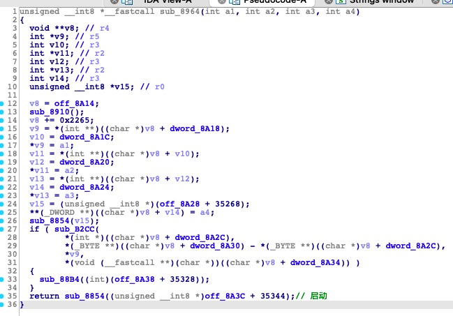

启动qiling

-   使用官方提供的uboot模板，从decompress\_kernel函数的开始执行
-   设置两块内存，分别是输出的开始（保存解压完成的内核）和malloc的开始（用于申请空间）
-   设置镜像的加载地址为0（因为函数内部写死了偏移量，如果指定基地址会报错）
-   为了方便调试，添加了一个异常处理函数，用于打印结束时的状态（指定为DISASM模式运行速度会变慢）
-   结束的hook会保存对应的内容，由于不清楚解压后的文件有多大，所以直接保存预留的全部内存（100M）多余部分不会影响binwalk的分析

```python
#!/usr/bin/env python3
#
# Cross Platform and Multi Architecture Advanced Binary Emulation Framework
#
import struct
from typing import Mapping
import sys
sys.path.append("..")
import traceback
from qiling.core import Qiling
from qiling.const import QL_ARCH, QL_OS, QL_VERBOSE,QL_INTERCEPT
from qiling.os.const import STRING


start=0
decode_start=0
def end(ql:Qiling):
    #8000B5D4
    ql.log.info(f"加密数据结束：{ql.arch.regs.read('r0')}")
    if ql.arch.regs.read('r0')==1:
        print("解密成功")
        custom_error_handler(ql)
    else:
        print("解密失败")
    
def debug_hook(ql:Qiling):
    global start
    start=ql.arch.regs.read('r0')
    print("加密数据开始地址：",hex(ql.arch.regs.read('r0')))
    print("加密数据长度：",hex(ql.arch.regs.read('r1')))
    
    print(f"解密后数据存放地址:{hex(0x100000+0x80000000)}")
    # r3=struct.unpack("<I",ql.mem.read(r3,4))[0]
def __map_regs() -> Mapping[int, int]:
    """Map Capstone x86 regs definitions to Unicorn's.
    """

    from capstone import x86_const as cs_x86_const
    from unicorn import x86_const as uc_x86_const

    def __canonicalized_mapping(module, prefix: str) -> Mapping[str, int]:
        return dict((k[len(prefix):], getattr(module, k)) for k in dir(module) if k.startswith(prefix))

    cs_x86_regs = __canonicalized_mapping(cs_x86_const, 'X86_REG')
    uc_x86_regs = __canonicalized_mapping(uc_x86_const, 'UC_X86_REG')

    return dict((cs_x86_regs[k], uc_x86_regs[k]) for k in cs_x86_regs if k in uc_x86_regs)

# capstone to unicorn regs mapping
CS_UC_REGS = __map_regs()
def custom_error_handler(ql):
    # if ql.verbose & QL_VERBOSE.EXCEPTION:
    #     print("Exception:", exception)

    # 获取寄存器信息
    md = ql.arch.disassembler
    md.detail = True
    regs = ["r0", "r1", "r2", "r3",
                "r4", "r5", "r6", "r7",
                "r8", "r9", "r10", "r11",
                "r12", "sp", "lr", "pc"]
    for R in regs:
        registers = ql.arch.regs.read(R)
        ql.log.info(f'{R}:{hex(registers)}')
    # 获取当前指令信息
    asm_addr=ql.arch.regs.pc-0x100
    current_instruction = ql.mem.read(asm_addr, 0x100+4)  # 读取当前指令的前16个字节
    # insn = next(md.disasm(current_instruction, ql.arch.regs.pc))
    for insn in md.disasm(current_instruction, asm_addr):
        nibbles = ql.arch.bits // 4

        trace_line = f'{insn.address+0x80008000:0{nibbles}x} | {insn.bytes.hex():24s} {insn.mnemonic:12} {insn.op_str:35s} '

        ql.log.info(f'{trace_line}')

    ql.log.info(f'encode:{hex(start)} {ql.mem.read(start,30)}')
    ql.log.info(f'decode:{hex(decode_start)} {ql.mem.read(decode_start,30)}')
    
    with open("vmlinux_qiling",'wb') as fd :
        fd.write(ql.mem.read(decode_start,0xffffff))

def get_kaimendaji_password():
    def partial_run_init(ql: Qiling):
        # argv prepare
        global decode_start
        decode_start=0x1000000+0x80000000
        ql.mem.map(decode_start, 0x1000000, info='my_hook')
        # ql.mem.write(0x10000, b'ubuntu')
        ql.arch.regs.write('r0',decode_start)
        ql.mem.map(0x2000000+0x80000000, 0x1000000, info='my_hook1')
        ql.arch.regs.write('r1',0x2000000+0x80000000)
        ql.arch.regs.write('r2',0x3000000-1+0x80000000)
        ql.arch.regs.write('r3',1)
        

    with open("../uImage", "rb") as f:
        uboot_code = f.read()
    ql = Qiling(code=uboot_code[0x40:], archtype=QL_ARCH.ARM, ostype=QL_OS.BLOB, profile="uboot_bin.ql", verbose=QL_VERBOSE.DEBUG)

    image_base_addr = ql.loader.load_address
    print("image base :",hex(image_base_addr))
    partial_run_init(ql)
    # ql.debugger = "qdb"

    ql.hook_address(debug_hook,0x8000B51C-0x80008000)
    ql.hook_address(end,0x8000B5D4-0x80008000)
    try:
        ql.run(0x80008AAC-0x80008000,0x80008B40-0x80008000)
    except Exception as e:
        print(e)
        custom_error_handler(ql)
    
if __name__ == "__main__":

    get_kaimendaji_password()
```

得出的文件和前面得到的类似

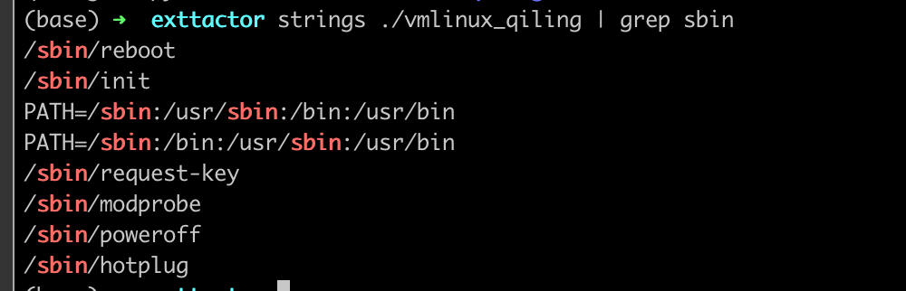

## 得到内核elf文件

使用vmlinux\_to\_elf 分析最终得到可以用ida分析的内核elf文件

```python
python ~/tools/vmlinux-to-elf/vmlinux_to_elf/main.py ./vmlinux_qiling vmlinux_elf
```

## 得到文件系统

有理由猜测文件系统和内核使用同样的加密方式，

## 总结

XZ为流式解压，流的含义为分成块，每处理一块之后赋予下一种状态并处理下一个块，每个块有类似的处理逻辑。

xz在实现时由于类似的处理逻辑较多，经过编译器优化后，ida看到很多goto语句这会增加逆向难度。花时间熟悉xz源码有非常有助于分析。

从uImage的xz压缩包中解压出来的vmlinux文件结构并非elf文件格式，需要进行一些处理。

## 现有解压方案

这个项目描述了一下解密的方式，实现了一个unsquashfs的补丁，可以解密被tvt头修改过的squashfs文件系统

[https://github.com/zb3/tvt-firmware-decryptor/tree/master](https://github.com/zb3/tvt-firmware-decryptor/tree/master "https://github.com/zb3/tvt-firmware-decryptor/tree/master")

## 植入后门（失败）

方法

-   1、编译自定义的shell文件，替换为内部的一个文件（如ping）通过从web端访问ping命令来执行该文件获取shell
-   2、修改服务二进制文件中的字符串，修改为对应的命令

### 编译buildroot

在编译自定义的二进制文件时需要使用libuClibc作为标准库，而不是libc.so，这需要使用buildroot指定

编译buildroot问题解决 [https://cloud.tencent.com/developer/article/1173067](https://cloud.tencent.com/developer/article/1173067 "https://cloud.tencent.com/developer/article/1173067")

### 失败总结

固件中删除了nc，wget，tftp，telnetd等文件传输工具，修改的固件文件大小有变化会启动失败。想到的解决方案是1、把文件放到硬盘或u盘然后修改服务文件字符串。2、直接用nfs生成后门的汇编，替换服务文件中一段代码。（注：这东西有芯片级的保护，执行命令要加入从驱动中读取的安全码，在没有调试的情况下直接命令注入获取shell也不大行）。

## 打包

首先打包原始固件的前半部分，直到squashfs文件系统的开始

```bash
dd if=../MX25L25633F@WSON8_20230829_113609.BIN bs=1 skip=0 count=3145728 of=new_firm.BIN
```

其次，打包squashfs文件系统。squashfs内包含很多xz压缩，这些xz压缩被修改为了tvt头，打包需要重新打包成这种格式。

根据之前的分析，修改mksquashfs的源码，思路为，在每个xz包内容压缩完毕之后在内存中修改其内容。但是tvt头比xz头要大，需要重新申请空间。

使用malloc和free会失败（可能跟多现成cache有关），这里采用mmap获取空间。多余的空间不释放

具体修改内容如下

```bash
diff --git a/squashfs-tools/xz_wrapper.c b/squashfs-tools/xz_wrapper.c
index 242c94f..b0711b1 100644
--- a/squashfs-tools/xz_wrapper.c
+++ b/squashfs-tools/xz_wrapper.c
@@ -26,6 +26,9 @@
 #include <string.h>
 #include <stdlib.h>
 #include <lzma.h>
+#include <sys/mman.h>
+#include <fcntl.h>
+#include <unistd.h>

 #include "squashfs_fs.h"
 #include "xz_wrapper.h"
@@ -446,7 +449,7 @@ static int xz_compress(void *strm, void *dest, void *src,  int size,
   for(i = 0; i < stream->filters; i++) {
     struct filter *filter = &stream->filter[i];

-    if(lzma_lzma_preset(&stream->opt, LZMA_PRESET_DEFAULT))
+    if(lzma_lzma_preset(&stream->opt, LZMA_PRESET_DEFAULT))//设置预设级别
       goto failed;

     stream->opt.dict_size = stream->dictionary_size;
@@ -469,9 +472,22 @@ static int xz_compress(void *strm, void *dest, void *src,  int size,
       */
     return 0;

+  size_t new_size=selected->length+4+6;
+  char * new_buff=0;
+  new_buff=mmap(NULL,((new_size/1024)+1)*1024,PROT_READ | PROT_WRITE, MAP_PRIVATE | MAP_ANONYMOUS, -1, 0);
+
+  const char* new_header = "\xe2\x74\x56\x74\x00\x50\x4b\x47\xb3\xe3";
+  const size_t new_header_size = 10;
+  const char* new_tail="\x05\xc5\x00\x74\x56\x74\x5e\x00";
+  memcpy(new_buff,new_header,new_header_size);//tvt头
+  memcpy(new_buff+new_header_size,selected->buffer+5,selected->length-2-5);//拷贝除xz头尾的剩余内容
+  memcpy(new_buff+new_header_size+selected->length-2-5,new_tail,8);//拷贝tvt尾
+  // free(selected->buffer);
+  selected->buffer=new_buff;
+  selected->length=new_size;
   if(selected->buffer != dest)
     memcpy(dest, selected->buffer, selected->length);
-
+
   return (int) selected->length;


```

经过调试发现，严谨地说，实际的tvt头为`\xe2\x74\x56\x74\x00\x50\x4b\x47\xb3\xe3`，tvt尾为

`\x05\xc5\x00\x74\x56\x74\x5e\x00`.

使用编译好的mksquashfs完成压缩，使用前文的unsquashfs测试压缩包有效

```bash
mksquashfs ../exttactor/squashfs-root ./squashfs-root.squashfs -comp xz
unsquashfs ./squashfs-root.squashfs

```

使用dd命令添加文件系统到最终文件

-   skip为输入文件的偏移
-   seek为输出文件的偏移

```bash
dd if=./squashfs-root.squashfs bs=1 seek=3145728 of=new_firm.BIN
```

seek始终为输出文件的末尾，skip可以通过binwalk查看

```bash
dd if=../MX25L25633F@WSON8_20230829_113609.BIN bs=1 skip=27262976 seek=39274758 of=new_firm.BIN
```

[tvt漏洞分析](https://www.wolai.com/jz5rx8GRUwmDQN3r1ykK9V "tvt漏洞分析")
